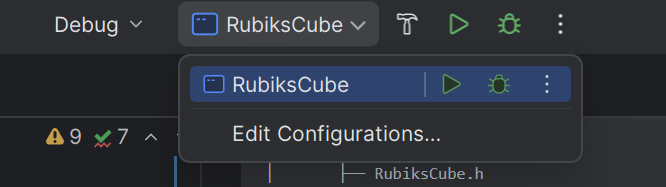
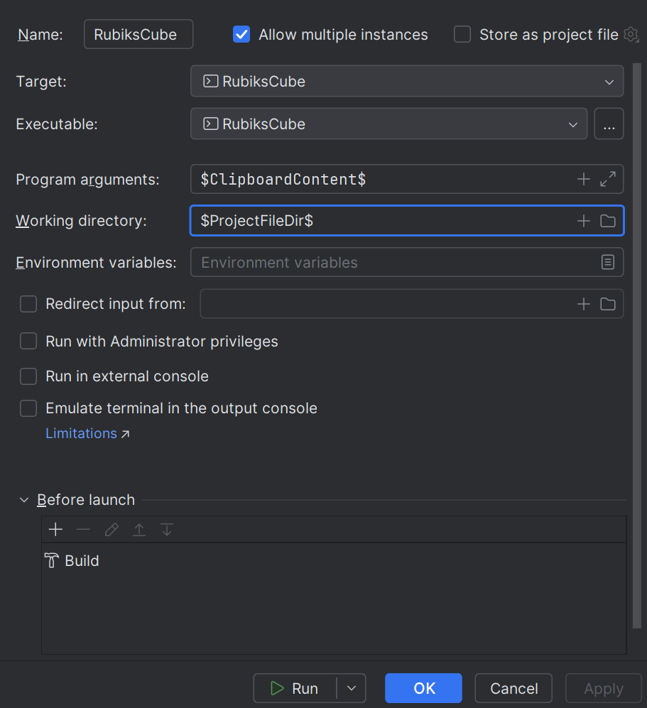

# RubiksCube Solver


## Table of Contents

1. [Project Overview](#project-overview)
2. [Prerequisites](#prerequisites)
3. [Features](#features)
4. [Directory Structure](#directory-structure)
5. [Installation & Build](#installation--build)
6. [Future developments](#Future-developments)
7. [License](#license)

---

## Project Overview

A C++ project that implements that implements multiples algorithms such as BFS,DFS,IDDFS and “heuristic‐driven” AI-algorithm called IDA* introduced by E.Korf in his [research paper](https://www.cs.princeton.edu/courses/archive/fall06/cos402/papers/korfrubik.pdf) in 1985.

Under the hood, you’ll explore:

- **State Representation & Data Structures**: Custom cube-state models (1D/3D arrays, bitboards) and fast permutation indexers.
- **Heuristic Design**: Pattern databases as admissible heuristics, and how their precomputation accelerates search.
- **Algorithmic Analysis**: Time- and space-complexity considerations for each solver, and how heuristic quality affects performance.
- **OOP & SOLID Principles**:
   - **Abstraction**: Clean interfaces (`RubiksCube`, `PatternDatabase`, `Solver`).
   - **Encapsulation**: Implementation details hidden behind `.h`/`.cpp` boundaries.
   - **Inheritance & Polymorphism**: A `Solver` base class with interchangeable BFS/DFS/IDDFS/IDA* implementations.
   - **Separation of Concerns**: Clear layering between cube model, heuristic generator, and search engine.

By studying and extending this project, you’ll deepen your understanding of search algorithms, heuristics, complexity analysis, and robust software design—key topics you can discuss in any technical interview. Built with CMake and zero external dependencies, it’s a portable, self-contained demonstration of “core CS” applied to one of the most iconic puzzles in algorithmics.

## Prerequisites

- **CMake** ≥ 3.15 and **CLion** IDE 
- A **C++17**-compatible compiler (GCC, Clang, or MSVC)
- **Git** (optional, for cloning the repository)  
- good Knowledge of Oops fundamentals and AI search algorithms
---
## features

- **Four Solvers**: BFS, DFS, IDDFS, and heuristic‐driven IDA*.
- **Pattern‐Database Heuristics**: Precompute and plug in admissible heuristics.
- **Flexible Cube Models**: 1D/3D arrays and bitboard representations with fast indexing.
- **Clean OOP Architecture**: Abstract `Solver` interface, encapsulated cube models, and SOLID design.
- **CLI & CMake**: Easy configuration of algorithm, heuristic, and build—no external dependencies.


## Directory Structure

````
RubiksCubeSolver/
├── .gitignore
├── CMakeLists.txt
├── LICENSE
├── main.cpp
├── README.md
├── cmake-build-debug/           
├── DataBase/
│   ├── CornerDatabase.txt              
├── Model/
│       ├── PatternDatabase/     
│       │   ├── PatternDatabase.h
│       ├── RubiksCube.cpp
│       ├── RubiksCube.h
│       ├── RubiksCube1dArray.cpp
│       ├── RubiksCube3dArray.cpp
│       └── RubiksCubeBitBoard.cpp
├── Pattern_Database/    
│       ├── CornerDBMaker.cpp
│       ├── CornerDBMaker.h
│       ├── CornerPatternDatabase.cpp
│       ├── CornerPatternDatabase.h
│       ├── math.cpp
│       ├── math.h
│       ├── NibbleArray.cpp
│       ├── NibbleArray.h
│       ├── PatternDatabase.cpp
│       ├── PatternDatabase.h
│       └── PermutationIndexer.h
└── Solvers/                     
         ├── BfsSolver.h
         ├── DfsSolver.h
         ├── IdaStarSolver.h
         └── IddfsSolver.h
````


---


## Installation & Build

```bash
# 1.Clone the repository
git clone https://github.com/Multiset-24/Rubiks-cube.git and then open folder in Clion IDE

# 2.Click on edit configuration options as shown below image for you there will bw no Rubiks cube there so click on edit configuration or add configurations
```



```bash
# 3.Now click on + options on top left in appeared window

# 4.Now click on Cmake Application and fill the options as below
```



```bash
# 5.Now click on Run and build (Hammer symbol) on right of configuration and you are all set .

# 6.By default Solver is set to IDA* but you can change it to any of the algorithm you want and feed your cube in custom cube 3d array shuffled upto 8 times or use a random shuffle function .
```

## Future developments
+ This projects can be extended to solve more shuffled cube of the order of greater than 13 by accumulating the corner and edge database as originally presented by Korf in his research paper.         
         <br>
+ Computer Vision can be used to input cube from the user directly using webcam and building the model using python scripts for solver to solve the cube 

## License

[](https://opensource.org/licenses/MIT)

This project is licensed under the MIT License.  
See the [LICENSE](LICENSE) file for more details.


